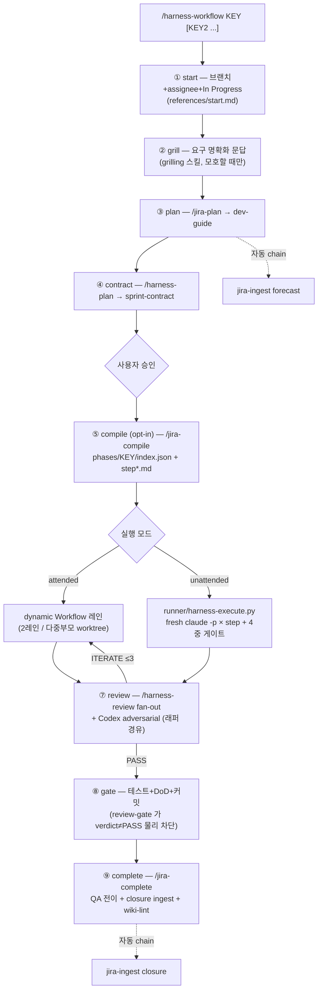

# claude_jira_harness

> Jira × Harness × LLM Wiki — 한 줄짜리 요구사항을 **영구 지식 자산**까지 밀어붙이는 Claude Code 스킬 셋. 설계·구현·운영 SSoT 모두 **dhpyun** ([@bigbulgogiburger](https://github.com/bigbulgogiburger)) 작성.

Jira 이슈 한 줄을 받아서 **start → grill → plan → contract → (compile) → execute → review → gate → complete** 풀사이클을 `/harness-workflow` **단일 진입점**으로 밀고, 그 위에 다중 에이전트 리뷰·**물리 커밋 게이트(JSON deny)**·headless 러너(무인 step 실행)·사후 채점, 그리고 모든 산출물을 **한 번 흡수하면 영구 자산이 되는 LLM Wiki**로 누적하는 사용자 스코프 스킬 모음. 부가로 코드베이스 AI 준비도 감사, knowledge graph 추출, Spring Boot 리팩토링, raster 이미지 생성, CLAUDE.md 자동 정리까지 한 레포에 담았다.

## ✨ 한눈에

| 카테고리 | 개수 |
| -------- | :--: |
| 워크플로 (유일 진입점 + 내부 단계 스킬) | 1 + 6 |
| Harness Engineering (게이트·채점·프로비저닝) | 4 |
| Headless Runner (무인 step 실행기) | 1 셋 |
| LLM Wiki (영구 지식 자산화) | 3 + 1 SSoT |
| 코드베이스 분석·리팩토링 | 3 |
| 부가 스킬·명령어 | 3 |

- **유일 진입점** — 구 9개 슬래시 명령 체인을 `/harness-workflow` 하나로 축소 (2026-07 ADR-106). `/jira-start`·`/jira-clarify`·`/jira-test`·`/jira-commit`·`/harness-resume` 는 폐기 — 전부 워크플로의 **내부 단계**가 됐고, 상세 절차는 단계 진입 시에만 lazy-load 되는 `references/*.md` 로 강등 (표면 1,589줄 → 205줄, **87% 축소**).
- **물리 커밋 게이트** — verdict ≠ PASS 면 PreToolUse hook 이 `permissionDecision:"deny"` JSON 으로 `git commit` 자체를 차단. `--dangerously-skip-permissions` 에서도 유효. auto 모드는 **fail-closed** (파싱 실패 = UNKNOWN 도 차단). ⚠ 구버전의 `exit 1` 방식은 공식 hook 시맨틱상 **비차단**이었다 — upgrade 필수.
- **Headless Runner** — dev-guide 를 step 시퀀스로 컴파일(`/jira-compile`)한 뒤 러너(`runner/harness-execute.py`)가 step 마다 fresh `claude -p` 세션을 돌린다. **모델은 코드만 쓰고**, 검증(AC 재실행·probe·diff 범위·FORBID)과 commit 권한은 러너가 가진다 — 모델 자기보고를 신뢰하지 않는 결정론 게이트.
- **병렬 = dynamic Workflow** — Agent Teams 는 운영 실측 결함 4건(시퀀스 무시·worker hang·모델 오버라이드 미적용 2회)으로 **사용 금지**. 병렬은 ① 단일이슈 2레인(BE/FE) ② 다중부모 worktree fan-out 2모드, 전 레인 `opts.model` 명시 + 모델 스모크 프로브.
- **영구 지식 자산화** — dev-guide·ADR·외부 문서를 build-time 합성해 `docs/INDEX.md`·`docs/LOG.md` wiki 로 누적. RAG 아닌 원본 보존 + 합성 패턴. 러너의 선별 가드레일 주입(context_refs)도 이 wiki 의 cross-ref 를 소스로 쓴다 — **전량 주입 대비 ~1.3% 크기**.

## ⚡ 5분 만에 시작하기 (0 → 첫 이슈 완료)

**1️⃣ Jira MCP 설정 + 인증**

```bash
claude mcp add atlassian -t sse https://mcp.atlassian.com/v1/sse
```

세션에서 `/mcp` → `atlassian` → **Authenticate** 로 OAuth 인증 (`connected` 확인).

**2️⃣ `/organize-claude-md full`** — `CLAUDE.md` 를 Lazy Loading 참조 구조로 재구성.

**3️⃣ `/harness-setup auto`** — 스택 자동 감지 후 프로젝트 전용 에이전트·**hooks 3종**(context-inject·compile-check·review-gate)·`.claude/runtime/` 프로비저닝. 멱등. 배포 직후 **게이트 실차단 스모크(V6)** 를 스스로 돌려 "게이트가 닫혀 있음"을 실측으로 증명한다.

**4️⃣ `/harness-workflow <ISSUE>`** — 이슈 하나를 풀사이클로. 부모 이슈에 Jira 하위이슈가 있으면 플래그 없이 자동으로 미러(전이 동기화 + 짧은 댓글)한다.

```
/harness-workflow PROJ-7
```

## 🔄 엔드투엔드 파이프라인



> 사람이 개입하는 지점은 ④→⑤ 사이 승인, review 의 ESCALATE, 러너의 blocked/error 해제뿐. attended 레인과 unattended 러너는 ⑤ compile 산출물(`index.json` = 재개 SSoT)을 공유하므로 언제든 갈아탈 수 있다.

## 🧰 스킬 카탈로그

### 워크플로 — 유일 진입점 + 내부 단계 (1 + 6)

| 스킬 | 역할 | 비고 |
| ---- | ---- | ---- |
| **`/harness-workflow <KEY>`** | 풀사이클 유일 진입점 — 단계 결정표 + 산출물 경로 + 게이트 조건. 상세는 `references/{start,clarify,gate,parallel-modes}.md` lazy-load | 구 `/jira-start`·`/jira-clarify`·`/jira-test`·`/jira-commit`·`/harness-resume` 폐기 — 트리거 키워드("커밋해줘" 등)를 이 스킬이 흡수, 해당 **단계만** 수행 |
| `/jira-create` | 자연어/문서 → 단일 이슈 또는 에픽→이슈→하위 계층 일괄 등록 | 워크플로 시작 전 |
| `/jira-plan <KEY>` | dev-guide MD 생성 (스택 페르소나·Dynamic Workflow recon) | ③ 단계. §5 병렬 가이드는 **Workflow 레인 표**(모델 명시 필수) |
| `/harness-plan <KEY>` | Sprint Contract (DoD·Verify Targets·인간 게이트) | ④ 단계 |
| `/jira-compile <KEY>` | dev-guide + contract → `phases/<KEY>/index.json` + 자기완결 step*.md 컴파일. ac(실행 커맨드만)·probe(anti-gaming)·touched_files·model 티어링·인간게이트 blocked 선언 | ⑤ 단계 — **대형 이슈·무인 opt-in** (소형은 attended 가 정량적으로 유리) |
| `/jira-execute <KEY>` | dev-guide 기반 구현. 병렬 = dynamic Workflow 레인 | ⑥ attended 경로 |
| `/jira-complete <KEY>` | 최종 검증 + QA 전환 + closure ingest·wiki-lint 자동 chain | ⑨ 단계 |

### Harness Engineering (4)

| 스킬 | 역할 | 호출 시점 |
| ---- | ---- | --------- |
| `/harness-setup` | 스택 감지 → 에이전트/hooks 3종/runtime 프로비저닝 (멱등). **V6 게이트 실차단 스모크** 내장. upgrade scope 는 legacy 결함(구 `exit 1` 게이트·Stop hook 배선·사장된 metrics)을 감지해 교체 제안 | 새 프로젝트 합류 시 |
| `/harness-review` | 프로젝트별 전문 에이전트 fan-out + aggregate verdict (PASS/ITERATE/ESCALATE) | ⑦ 단계 리뷰 루프 |
| `/harness-gate` | 커밋 직전 최종 게이트 (verdict + 빌드/타입체크/린트) | ⑧ gate 단계 내부 |
| `/harness-shadow` / `/harness-score` | baseline 비교 lift 측정 / post-merge VALID·INVALID 채점 | 주기적 |

### Headless Runner (`runner/`)

무인 실행기 템플릿 — 프로젝트의 `scripts/` 로 복사해 쓴다. **"모델은 코드만 쓴다"** 가 계약: 검증과 commit 은 전부 러너가 결정론적으로 수행한다.

| 파일 | 역할 |
| ---- | ---- |
| `harness-execute.py` | step 러너 — fresh `claude -p`(stdin 프롬프트·`--disallowedTools` 예방층·per-step `--model` 티어링) → **4중 게이트**: ⓐ AC 커맨드 러너가 직접 재실행 ⓑ probe expect 정규식 ⓒ git diff 가 선언 범위 안인지 (동시 세션의 사전 dirty 파일은 baseline 격리) ⓓ FORBID 재매칭(diff 추가 라인만 — 산문 오발 방지) → 통과 시에만 러너가 commit. 재시도 = 에러 주입 fresh 세션 ×3. `index.json` 이 재개 SSoT (첫 pending 부터) |
| `test_harness_execute.py` | 러너 자체 테스트 22케이스 (`python runner/test_harness_execute.py`) |
| `codex-review.sh` | Codex adversarial 표준 래퍼 — stdin 봉인(`< /dev/null`, openai/codex #20919 deadlock 차단)·출력 파일화·hard timeout+무진행 watchdog·프로세스 트리 kill(orphan diff-kill)·호출 계측 로그. **exit 42 = 폴백 계약**: Claude adversarial(opus skeptic)로 자동 대체 — 파이프라인 가용성을 Codex 와 분리 |
| `_always.example.md` | step 세션 공통 주입용 프로젝트 NEVER 요약 예시 (`phases/_always.md` 로 배치) |

### LLM Wiki — 영구 지식 자산화 (3 + 1 SSoT)

| 스킬 | 역할 | 호출 시점 |
| ---- | ---- | --------- |
| `/jira-ingest` | dev-guide 생성/완료마다 `docs/INDEX.md` + `docs/LOG.md` + ADR/sprint cross-reference 증분 갱신 | `/jira-plan`·`/jira-complete` 자동 chain |
| `/llm-wiki` | 임의 정보원(웹·PDF·책·이미지·코드 리포) build-time 합성. 원본 보존 + wikilink 그래프 | 자연어 트리거 |
| `/wiki-lint` | 14가지 정합성 체크 (orphan/stale/broken xref/Jira 불일치 등) | `/jira-complete` 자동 chain 또는 명시 호출 |
| [`_wiki-schema.md`](skills/_wiki-schema.md) | `jira-ingest` ↔ `wiki-lint` 공유 SSoT | — |

### 코드베이스 분석·리팩토링 (3)

| 스킬 | 역할 |
| ---- | ---- |
| `/codebase-ai-readiness` | 7-카테고리 100점 루브릭 감사 → JSON 점수표 + HTML 대시보드 + ROI 액션 리스트 |
| `/graphify` | 임의 input → knowledge graph → HTML/JSON/Obsidian/Neo4j 내보내기 |
| `/spring-boot-refactor` | DDD·CQRS·Read/Write 분리·N+1 자동 분석·제안 |

### 부가 스킬·명령어 (3)

| 항목 | 역할 |
| ---- | ---- |
| `/grilling` + `/grill-me` | 빌드 전 플랜 적대 검증 인터뷰 — **한 번에 하나씩** 질문. 워크플로 ② grill 단계가 이걸 쓴다. **[Matt Pocock](https://github.com/mattpocock)의 grilling 스킬 차용** |
| `imagegen` | Codex CLI `image_gen` thin orchestrator (raster 전용) |
| `/organize-claude-md` | CLAUDE.md Lazy Loading 재구성 + 프레임워크 특화 스캔 |

### 공통 컨벤션 (SSoT)

| 문서 | 역할 |
| ---- | ---- |
| [`harness-workflow/references/parallel-modes.md`](skills/harness-workflow/references/parallel-modes.md) | 병렬 2모드 SSoT — ① 단일이슈 2레인(BE=opus/FE=sonnet) ② 다중부모 worktree fan-out(충돌 매트릭스·클러스터링). 모델 티어링 운용 규칙 3개(전 `agent()` model 명시 / 웨이브 시작 스모크 프로브 / 최상위 모델 구현 레인은 사유 필수) |
| [`_subtasks-convention.md`](skills/_subtasks-convention.md) | Jira 하위이슈 **미러 규칙** (전이 동기화·짧은 댓글·commit SHA 인용). 구 `--subtasks` 플래그 표면은 폐지 — 워크플로가 플래그 없이 수행 |
| [`_stack-detection.md`](skills/_stack-detection.md) · [`_harness-guard.md`](skills/_harness-guard.md) | 스택 감지/페르소나/검증 명령 단일표 · HARNESS_MODE 가드 정책 |

## 🆕 What's New — v2 대개편 (2026-07, ADR-106)

- **명령 표면 9 → 유일 진입점** — `/jira-start`·`/jira-clarify`·`/jira-test`·`/jira-commit`·`/harness-resume` 폐기. 내용은 `harness-workflow/references/` 로 강등(lazy-load), 재개는 상태 파일(`workflow-state.json` / `phases/<KEY>/index.json`) 직독으로 일원화. 문서-실무 괴리(실무는 이미 grill→plan→2레인→리뷰→게이트로 진화)를 표면이 따라간 것.
- **review-gate 물리화** — 구 `exit 1` 이 공식 hook 시맨틱상 **비차단**이었음을 발견·수정. 신판 = `permissionDecision:"deny"` JSON + 2차 하드닝(jq/PCRE 명령 추출·`git -C` 등 토큰 판정·verdict anchor 파싱·fail-closed). 시뮬레이션 8케이스 + 실차단 실증.
- **Agent Teams → dynamic Workflow 확정** — 실측 결함 4건(전원 게이트 무시 직진·worker hang·모델 오버라이드 미적용 전원 최상위 모델 상속 2회)으로 teammate 방식 폐기. `jira-execute` §4A 재작성, `parallel-fanout.md` → `references/parallel-modes.md` 로 대체.
- **Headless Runner (신규)** — `/jira-compile` + `runner/harness-execute.py`. 실전 E2E 검증: 1차 시도에서 probe 가 Windows CRLF 실결함을 잡아 거부 → 에러 주입 fresh 재시도에서 모델이 자가 진단·수정 → 러너 단독 commit (121s). 실패 경로(재시도 소진 → error·원인 보존·비용 누적)까지 실증. 가드레일은 전량 주입이 아니라 wiki cross-ref **선별 주입**(실측 ~1.3%).
- **Codex adversarial 래퍼 (신규)** — stdin non-TTY deadlock(openai/codex #20919)으로 32분 hang 나던 것을 래퍼로 원천 차단 + exit 42 폴백 계약. 첫 실계측 OK(492s/178KB, hang 0), TIMEOUT 강제 테스트로 프로세스 트리 kill 까지 검증.
- **harness-setup v2** — 신규 프로젝트에 구 결함(exit-1 게이트·Stop hook·사장 metrics)을 복제하던 템플릿 전면 교체 + 배포 직후 **V6 게이트 실차단 스모크** 절차 신설. upgrade scope 가 legacy 를 감지해 교체 제안.

## ⚙️ Dynamic Workflow

`/jira-plan` 은 영향 범위가 넓은 이슈에서 Claude Code **Workflow 툴**로 *코드 + 위키 + 이슈 + memory* 멀티모달 fan-out → dev-guide 초안 → 적대 검증까지 도는 **Dynamic Workflow 모드**를 지원한다 (미지원 환경은 인라인 폴백). 구현·리뷰 병렬도 같은 엔진 — `parallel-modes.md` 참조.

| 기능 | 최소 버전 | 미충족 시 |
| ---- | --------- | --------- |
| Workflow 툴 | Claude Code **v2.1.154+** (기본 활성) | 인라인 모드 자동 폴백 |
| Headless Runner | `claude` CLI + Python 3.10+ | attended 경로만 사용 |

> ultracode 전역 ON 은 비권장 — `HARNESS_MODE=auto` 와 함께 쓰면 승인 게이트가 무력화되고 토큰만 폭증한다. fan-out+verify 엔진은 understand(plan)/audit(repo-wide)/review(diff) scope 로 선택 적용.

## 🚀 빠른 시작

**(a) 풀사이클 한 방**

```
/harness-workflow PROJ-123
```

**(b) 단계만 골라 쓰기** — 폐기 명령의 키워드는 워크플로가 흡수한다. "커밋해줘" → gate 단계만, "이어서 작업" → 재개 절차만.

**(c) 멀티부모 병렬** — worktree 격리 + 충돌 매트릭스 사전 산출 (`references/parallel-modes.md`).

```
/harness-workflow PROJ-214 PROJ-215 PROJ-216
```

**(d) 대형 이슈 무인 실행 (opt-in)**

```
/harness-workflow PROJ-500          # ⑤ compile 까지 진행 후
python scripts/harness-execute.py phases/PROJ-500     # 러너가 step 루프 (blocked/error 에서 정지)
```

## 설치

```bash
git clone https://github.com/bigbulgogiburger/claude_jira_harness.git
cd claude_jira_harness

# 스킬 (user-scope)
mkdir -p ~/.claude/skills
cp -R skills/* ~/.claude/skills/

# (선택) headless runner — 사용할 프로젝트의 scripts/ 로
cp runner/harness-execute.py runner/test_harness_execute.py runner/codex-review.sh <프로젝트>/scripts/
cp runner/_always.example.md <프로젝트>/phases/_always.md   # 프로젝트에 맞게 편집
```

또는 심볼릭 링크로 (이후 `git pull` 만으로 즉시 반영):

```bash
for d in skills/*/; do
  ln -s "$(pwd)/$d" "$HOME/.claude/skills/$(basename "$d")"
done
```

기존 사용자 **업그레이드 주의**: 폐기된 5개 스킬 디렉토리(`jira-start`·`jira-clarify`·`jira-test`·`jira-commit`·`harness-resume`)가 `~/.claude/skills/` 에 남아 있으면 삭제할 것 (트리거 충돌 방지). 프로젝트별 hooks 는 `/harness-setup upgrade` 로 legacy 게이트를 교체.

## 요구사항

- Claude Code (CLI 또는 데스크톱 앱) — 기본 사이클·Harness·LLM Wiki 는 버전 무관 동작
- Dynamic Workflow (선택): Claude Code **v2.1.154+** — 미지원이면 인라인 폴백
- Headless Runner (선택): Python 3.10+ · `claude` CLI · Git Bash(Windows)
- Jira 사용 시: MCP Atlassian 서버 (`mcp__atlassian__*`)
- Harness: 프로젝트 루트 `.claude/runtime/` 쓰기 권한 · LLM Wiki: `docs/` 쓰기 권한
- Codex 래퍼 (선택): OpenAI Codex CLI — 없거나 죽어도 폴백 체인이 리뷰를 대체한다
- `imagegen`: Codex CLI + ChatGPT 로그인 / `/graphify`: Python 환경

## Author

**dhpyun** — [@bigbulgogiburger](https://github.com/bigbulgogiburger)

본 스킬 셋의 설계·구현·SSoT 문서·운영 패턴 (jira-*, harness-*, headless runner, llm-wiki / wiki-lint, parallel-modes, organize-claude-md, _subtasks-convention) 일체가 본인 작품이다. 실제 사내 Spring Boot 3.3.8 / Vue 3 / Java 21 풀스택 프로젝트의 스프린트 사이클에서 검증·정착됐고, v2 개편은 실측 기반(게이트 시뮬레이션·러너 E2E 파일럿·Codex 계측)으로 확정했다.

## 라이선스

MIT — `LICENSE` 참조.

## 비고

원본은 사내 사용 목적으로 작성됐고, 공개 배포를 위해 모든 사내 식별자(프로젝트 키, 마이크로서비스 명, 도메인 클래스/필드, 커스텀 어노테이션)를 중립적인 예시(`PROJ-`, `backend/`, `frontend/` 등)로 치환했다. 본인 환경에 맞게 placeholder 를 바꿔 사용하면 된다.
