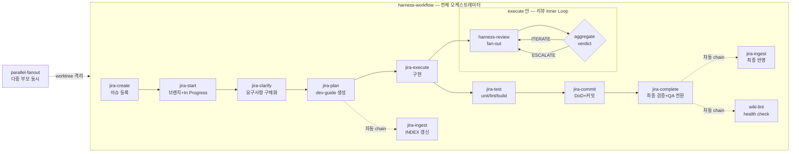

# claude_jira_harness

> Jira × Harness × LLM Wiki — 한 줄짜리 요구사항을 **영구 지식 자산**까지 밀어붙이는 Claude Code 스킬 셋. 설계·구현·운영 SSoT 모두 **dhpyun** ([@bigbulgogiburger](https://github.com/bigbulgogiburger)) 작성.

Jira 이슈 한 줄을 받아서 **등록 → 시작 → 구체화 → 계획 → 구현 → 테스트 → 커밋 → 완료** 전 사이클을 슬래시 명령으로 묶고, 그 위에 다중 에이전트 리뷰(Harness)와 사후 채점·Shadow 비교, 그리고 모든 산출물을 **한 번 흡수하면 영구 자산이 되는 LLM Wiki**로 누적하는 사용자 스코프 스킬 모음. 부가로 코드베이스 AI 준비도 감사, knowledge graph 추출, Spring Boot 리팩토링, raster 이미지 생성, CLAUDE.md 자동 정리까지 한 레포에 담았다.

## ✨ 한눈에

| 카테고리 | 개수 |
| -------- | :--: |
| Jira 워크플로우 | 8 |
| Harness Engineering | 8 |
| LLM Wiki (영구 지식 자산화) | 3 + 1 SSoT |
| 코드베이스 분석·리팩토링 | 3 |
| 부가 스킬·명령어 | 2 |

- **체이닝되는 단일 파이프라인** — `jira-create`부터 `jira-complete`까지 슬래시 명령 한 줄씩, 또는 `harness-workflow` 한 방으로 전 과정 자동 시퀀싱.
- **다중 에이전트 품질 게이트** — 변경마다 프로젝트별 전문 에이전트 fan-out 리뷰 + aggregate verdict + 사후 채점/Shadow 비교로 경험적 lift 측정.
- **영구 지식 자산화** — dev-guide·ADR·외부 문서를 build-time 합성해 `docs/INDEX.md`·`docs/LOG.md` wiki로 누적. RAG 아닌 원본 보존 + 합성 패턴.
- **병렬 fan-out 운영 규율** — 여러 부모 이슈를 git worktree 격리로 동시 실행하는 2-tier 직렬화·머지·복구 규칙까지 SSoT로 명문화.

## 🔄 엔드투엔드 파이프라인



> `harness-workflow`가 전 사이클을 감싸는 오케스트레이터이며, `plan`·`complete`에서 `jira-ingest`/`wiki-lint`가 자동 chain으로 분기하고, `execute` 안에서는 `harness-review`가 verdict 수렴까지 inner loop를 돈다. 여러 부모 이슈는 `parallel-fanout`이 worktree 격리로 동시에 워크플로를 띄운다.

## 🧰 스킬 카탈로그

### Jira 워크플로우 (8개)

한 줄 요구사항을 8단계 슬래시 명령으로 직렬화. 각 단계는 다음 단계의 입력을 준비하며, 중간에 멈췄다 재개해도 컨텍스트가 끊기지 않는다.

| 스킬 | 역할 | 호출 시점 |
| ---- | ---- | --------- |
| `/jira-create` | 자연어 한 줄 또는 문서 기반 단일 이슈 / 에픽→이슈→하위이슈 계층 일괄 등록 | 워크플로우 시작점 |
| `/jira-start <KEY>` | 이슈 조회 + feature 브랜치 생성 + In Progress 전환 | 작업 시작 |
| `/jira-clarify <KEY>` | Q&A로 요구사항 구체화, 멀티 프로젝트면 하위 이슈 자동 생성 | start 직후 |
| `/jira-plan <KEY>` | dev-guide MD 생성 (스택 페르소나 적용) | clarify 직후 |
| `/jira-execute <KEY>` | dev-guide 기반 실제 구현 (병렬 가능) | plan 직후 |
| `/jira-test <KEY>` | 스택별 unit/lint/build/all 테스트 자동 실행 | execute 직후 |
| `/jira-commit <KEY>` | DoD 체크 + 커밋 + Jira 한글 댓글 업데이트 | test 통과 후 |
| `/jira-complete <KEY>` | 최종 검증 + QA 상태 전환 | commit 직후 |

### Harness Engineering (8개)

Jira 사이클 위에 다중 에이전트 리뷰·게이트·채점·복구를 얹는 계층. `harness-workflow`가 모든 단계를 자동 시퀀싱하는 진입점이다.

| 스킬 | 역할 | 호출 시점 |
| ---- | ---- | --------- |
| `/harness-workflow <KEY>` | Jira 스킬 + Sprint Contract + 리뷰 Inner Loop 통합 오케스트레이터 | 전 사이클 한 방 진입점 |
| `/harness-setup` | 프로젝트 스택 감지 후 에이전트/훅/메트릭 인프라 자동 프로비저닝 (멱등) | 새 프로젝트 합류 시 |
| `/harness-plan <KEY>` | dev-guide 기반 Sprint Contract(DoD/Verify Targets/Out of Scope) 생성 | plan 보강 |
| `/harness-review` | 코드 변경에 프로젝트별 전문 에이전트 fan-out 후 aggregate verdict | execute 중 리뷰 루프 |
| `/harness-gate` | 커밋 전 최종 품질 게이트 (aggregate-verdict + 빌드/타입체크/린트) | commit 직전 |
| `/harness-shadow <KEY>` | `HARNESS_MODE=off` baseline vs full-run 비교로 counterfactual lift 측정 | 5이슈 중 1회 권장 |
| `/harness-score <KEY>` | post-merge VALID/INVALID 채점 (catch rate / FP rate 측정) | 머지 후 7일+ |
| `/harness-resume` | 체크포인트 복원으로 중단된 단계부터 재개 | 세션 중단 후 |

### LLM Wiki — 영구 지식 자산화 (3개 + 1 SSoT)

Karpathy LLM Wiki 패턴 기반. dev-guide·ADR·외부 문서 등 모든 산출물을 **build-time 합성**해 한 번 흡수하면 영구 자산이 되는 지식 베이스를 만든다. `/jira-plan`·`/jira-complete`가 자동으로 ingest/lint를 chain 호출하므로 별도 호출 없이도 wiki가 누적된다.

| 스킬 | 역할 | 호출 시점 |
| ---- | ---- | --------- |
| `/jira-ingest` | dev-guide 생성/완료마다 `docs/INDEX.md` + `docs/LOG.md` + ADR/sprint cross-reference 증분 갱신 (Jira 도메인 전용) | `/jira-plan`·`/jira-complete` 자동 chain, 또는 명시 호출 |
| `/llm-wiki` | 임의 정보원(웹·PDF·팟캐스트·책·이미지/OCR·음성·영상·코드 리포)을 build-time 합성. ingest/query/lint 모드 자동 추론 (명시 플래그 없음). 원본 보존(raw/ immutable) + wikilink 그래프(entities/concepts/sources/questions/syntheses) | "이 글 정리해줘", "위키에 추가", "내 위키에서 찾아줘" 등 자연어 트리거 |
| `/wiki-lint` | 14가지 정합성 체크(L01~L15, orphan / stale / broken xref / parent-sibling 비대칭 / Jira 상태 불일치 / memory drift / INDEX integrity)를 독립 실행해 부분 실패 격리. read-only by default, `--fix`·변경 승인 후만 write. 자동수정(✅) vs 수동 검토 분리 보고 | `/jira-complete` 자동 chain (high severity, non-blocking) 또는 명시 호출 |
| [`_wiki-schema.md`](skills/_wiki-schema.md) | `jira-ingest` ↔ `wiki-lint`가 공유하는 single source of truth | — |

### 코드베이스 분석·리팩토링 (3개)

레포 진단·구조 추출·아키텍처 개선용. 프레임워크 무관 진단(`codebase-ai-readiness`), 그래프 추출(`graphify`), Spring 전용 리팩토링(`spring-boot-refactor`)으로 역할이 갈린다.

| 스킬 | 역할 | 호출 시점 |
| ---- | ---- | --------- |
| `/codebase-ai-readiness` | 임의 git 레포를 7-카테고리 100점 루브릭으로 감사 → JSON 점수표 + 한국어 HTML 대시보드 + ROI 우선순위 액션 리스트. 프레임워크 무관 | 새 레포 합류 / OSS 평가 시 |
| `/graphify` | 임의 input(코드·docs·논문·이미지) → knowledge graph → community detection → HTML + JSON + audit report. god node + BFS·DFS 쿼리. Obsidian 볼트·MCP 서버·Neo4j·GraphML·wiki·`--watch` 증분 갱신까지 내보내기 | 코드베이스/구조 질의 시 |
| `/spring-boot-refactor` | Spring Boot DDD 강화, CQRS 적용, Service 계층 Read/Write 분리, 테스트 커버리지 개선, N+1 해결 자동 분석·제안 | Spring 리팩토링 시 |

### 부가 스킬·명령어 (2개)

워크플로우 밖의 보조 도구. raster 이미지 생성과 CLAUDE.md 자동 정리.

| 항목 | 종류 | 역할 |
| ---- | ---- | ---- |
| `imagegen` | skill | Codex CLI built-in `image_gen`을 메인 세션이 직접 오케스트레이션하는 thin orchestrator. 2~3개 질문으로 brief 합의 후 `codex exec` 백그라운드 호출 + Monitor 폴링, 결과는 `codex-image/`에 저장. **raster 전용** — SVG/벡터·코드 생성 금지 |
| `/organize-claude-md` | skill + command | CLAUDE.md를 Lazy Loading 참조 구조 + 프레임워크 특화 템플릿 + Mermaid 아키텍처로 재구성. Monorepo 분기 + CHANGELOG 분리 + ADR 자동 생성 안내. Spring Boot / Vue / Nuxt / React / Next.js / Flutter / NestJS / FastAPI / Django / Go 특화 스캔 |

### 공통 컨벤션 (SSoT)

여러 스킬이 공유하는 운영 규약. 단일 인스턴스만 돌릴 땐 신경 쓰지 않아도 되지만, 하위 작업 묶음이나 다중 부모 동시 실행에 들어가면 이 두 문서가 진실의 원천이다.

| 문서 | 역할 |
| ---- | ---- |
| [`_subtasks-convention.md`](skills/_subtasks-convention.md) | 부모 이슈 1개 + 하위 N개를 한 fan-out 단위로 처리하는 `--subtasks` 모드 SSoT. 산출물은 **부모 귀속**, 하위는 **트래킹 미러**. `harness-workflow --subtasks`가 자식 스킬 전부에 flag 자동 전파, 부모에 subtasks 없으면 일반 모드 폴백 |
| [`harness-workflow/parallel-fanout.md`](skills/harness-workflow/parallel-fanout.md) | `/harness-workflow <KEY1> <KEY2> …` 다중 부모 **2-tier 병렬** 격리·직렬화·머지·복구 규칙. Tier-1 worktree 격리 + Tier-2 teammate fan-out. 진입 게이트 10조건·머지 순서·승인 게이트 직렬화·Flyway V번호 할당표 명문화 |

## 🆕 What's New

- **`/jira-plan` — Dynamic Workflow 모드** — 이슈 분석 시 Claude Code **v2.1.154+** 의 `Workflow` 툴로 단방향 fan-out + verify 엔진을 범용·조건부로 적용해 dev-guide 생성 흐름을 강화. 전면 대체가 아니라 plan PoC scope로 흡수하며, Workflow 미지원·구버전이면 인라인 모드로 자동 폴백 (자세히는 아래 **⚙️ Dynamic Workflow & ultracode** 섹션 참조).
- **`/harness-workflow` — 모드 결정 트리 + 멀티부모 병렬** — 단일/`--subtasks`/다중 부모를 자동 판별하는 결정 트리. `<KEY1> <KEY2> …`로 여러 부모를 git worktree 격리해 2-tier(Tier-1 워크플로 + Tier-2 teammate)로 동시 실행하며, 머지 순서·승인 게이트·Hook race를 orchestrator가 직렬화.
- **`/graphify` — `references/` 리팩터 + 출력 확장** — 번들을 `references/`로 정리하고 산출물을 Obsidian·MCP·Neo4j·wiki 내보내기 + watch(증분 갱신)까지 확장.
- **`/llm-wiki` — `references/` + `scripts/` 번들화** — Karpathy 2026-04 gist 패턴 적용. 모드 자동 추론(ingest/query/lint), 원본 보존 + build-time 합성 원칙 정착.
- **`/wiki-lint` — 14 rules 전체 정의 + auto-patch** — L01~L15 규칙 전체 명문화, L14(Jira closure mismatch) + L15(coverage) 추가, JSON CI 출력 모드. `_wiki-schema.md`(SSoT) auto-patch로 스키마 정합성 자동 보정.

## ⚙️ Dynamic Workflow & ultracode (선택)

`/jira-plan` 은 영향 범위가 넓은 이슈에서 Claude Code 의 **Workflow 툴(Dynamic Workflows)** 로 *코드 + 위키 + 이슈 + memory* 를 멀티모달 fan-out → structured map → dev-guide 초안 → 적대적(adversarial) 검증까지 한 번에 돌리는 **Dynamic Workflow 모드 (A)** 를 옵션으로 지원한다. 조건 미충족이거나 Workflow 가 비활성이면 메인 세션이 직접 수행하는 **인라인 모드 (B)** 로 자동 폴백 — 구버전·미지원 환경에서도 깨지지 않는다.

### 버전 요구사항

| 기능 | 최소 버전 | 활성화 | 미충족 시 |
| ---- | --------- | ------ | --------- |
| **Workflow 툴 (Dynamic Workflows)** — `jira-plan` 모드 (A) | Claude Code **v2.1.154+** (2026-05-28) | 기본 활성 (별도 플래그 불필요) | `jira-plan` 인라인 모드 (B) 로 자동 폴백 |
| **Agent Teams** — `parallel-fanout` Tier-2 / `jira-execute` 병렬 구현 | Claude Code **v2.1.32+** | `CLAUDE_CODE_EXPERIMENTAL_AGENT_TEAMS=1` + `teammateMode` | 단방향 sub-agent fan-out 으로 폴백 (실험적·기본 비활성) |

> 나머지 모든 스킬(Jira 사이클·Harness 리뷰·LLM Wiki)은 위 기능 없이도 동작한다. 버전 게이트는 **Dynamic Workflow / 병렬 fan-out 최적화 경로에만** 적용된다.

### ultracode

**ultracode** 는 켜져 있으면(세션의 system-reminder 로 확인) "모든 실질적 작업에 대해 기본으로 Workflow 를 작성·실행" 하도록 만드는 Claude Code 모드다 — 토큰 비용을 제약으로 두지 않고 최대한 철저한 fan-out + 검증을 지향한다. Dynamic Workflow 모드 (A) 와 같은 엔진을 전역 기본값으로 끌어올리는 스위치라고 보면 된다.

> ⚠️ **전역 ON 은 권장하지 않는다.** Harness 를 `HARNESS_MODE=auto` 로 함께 쓰면 ultracode 가 워크플로우 **승인 게이트를 무력화**(프롬프트 자동 스킵)하고 토큰만 폭증한다. 이 스킬셋의 권장 방향은 ultracode 전역 활성 대신, fan-out + verify 엔진을 **understand(plan) / audit(repo-wide) / review(diff)** 3개 scope 로만 **선택 적용**하는 것이다 — `jira-plan` 의 Dynamic Workflow 모드 (A) 가 그 understand scope 구현이다.

## 🚀 빠른 시작

**(a) 기본 Jira 사이클** — 슬래시 명령을 한 단계씩, 자동 chain은 알아서 붙는다.

```
/jira-create                       (요구사항/문서 → 이슈 등록)
  → /jira-start PROJ-123
    → /jira-clarify PROJ-123       (요구사항 흐릿하면)
      → /jira-plan PROJ-123        ─┐  자동 chain
                                    ├─ /jira-ingest (docs/INDEX.md 갱신)
        → /jira-execute PROJ-123
          → /jira-test PROJ-123
            → /jira-commit PROJ-123
              → /jira-complete PROJ-123 ─┐  자동 chain
                                         ├─ /jira-ingest (최종 상태 반영)
                                         └─ /wiki-lint  (high severity health check)
```

**(b) `/harness-workflow` 한 방** — 전 과정을 오케스트레이터에 위임.

```
/harness-workflow PROJ-123

# 부모 + 하위 이슈를 한 묶음으로:
/harness-workflow PROJ-7 --subtasks
```

**(c) 멀티부모 병렬** — worktree 격리로 여러 부모를 동시에 (진입 게이트 10조건 충족 필수).

```
/harness-workflow PROJ-214 PROJ-215 PROJ-216 --subtasks
  # → orchestrator 가 3개 git worktree 격리 + Agent fan-out
  # → 충돌 매트릭스 + Flyway V 번호 할당표 사전 확정 필수
  # → 자세한 안전 가이드: skills/harness-workflow/parallel-fanout.md
```

## 설치

스킬은 `~/.claude/skills/<skill-name>/`, 슬래시 명령어는 `~/.claude/commands/<name>.md` 하위에 위치해야 Claude Code가 인식한다.

```bash
git clone https://github.com/bigbulgogiburger/claude_jira_harness.git
cd claude_jira_harness

# 스킬
mkdir -p ~/.claude/skills
cp -R skills/* ~/.claude/skills/

# 슬래시 명령어
mkdir -p ~/.claude/commands
cp -R commands/* ~/.claude/commands/
```

또는 심볼릭 링크로 (이후 `git pull` 만으로 즉시 반영):

```bash
for d in skills/*/; do
  ln -s "$(pwd)/$d" "$HOME/.claude/skills/$(basename "$d")"
done
for f in commands/*.md; do
  ln -s "$(pwd)/$f" "$HOME/.claude/commands/$(basename "$f")"
done
```

## 요구사항

- Claude Code (CLI 또는 데스크톱 앱) — 기본 Jira 사이클·Harness·LLM Wiki 는 버전 무관 동작
- `/jira-plan` Dynamic Workflow 모드 (선택): `Workflow` 툴 = Claude Code **v2.1.154+** (기본 활성). 구버전이면 인라인 모드로 자동 폴백 — 아래 **⚙️ Dynamic Workflow & ultracode** 섹션 참조
- 멀티부모 병렬 fan-out / `jira-execute` 병렬 구현 (선택): Claude Code **v2.1.32+** + `CLAUDE_CODE_EXPERIMENTAL_AGENT_TEAMS=1` (실험적·기본 비활성)
- Jira 사용 시: MCP Atlassian 서버가 활성화되어 있어야 함 (`mcp__atlassian__*` 도구 사용)
- Harness 채점/리뷰는 프로젝트 루트에 `.claude/runtime/` 쓰기 권한 필요
- LLM Wiki (`/jira-ingest`, `/llm-wiki`, `/wiki-lint`) 사용 시: 프로젝트 루트에 `docs/` 디렉토리 쓰기 권한
- `imagegen` 사용 시: OpenAI Codex CLI 설치 + ChatGPT Plus 로그인 (built-in `image_gen` 무료 한도 사용). 유료 fallback 은 `OPENAI_API_KEY` 명시 요청 시에만.
- `/codebase-ai-readiness` 사용 시: 감사 대상 레포 루트에 `.ai-readiness/` 쓰기 권한
- `/graphify` 사용 시: Python 환경 (`graphify-out/` 산출물 생성)

## Author

**dhpyun** — [@bigbulgogiburger](https://github.com/bigbulgogiburger)

본 스킬 셋의 설계·구현·SSoT 문서·운영 패턴 (jira-*, harness-*, llm-wiki / wiki-lint, parallel-fanout, organize-claude-md, _subtasks-convention) 일체가 본인 작품이다. 실제 사내 Spring Boot 3.3.8 / Vue 3 / Java 21 풀스택 프로젝트 운영 중 W1~W7 sprint 사이클에서 검증·정착됐다.

## 라이선스

MIT — `LICENSE` 참조.

## 비고

원본은 사내 사용 목적으로 작성됐고, 공개 배포를 위해 모든 사내 식별자(프로젝트 키, 마이크로서비스 명, 도메인 클래스/필드, 커스텀 어노테이션)를 중립적인 e-commerce 예시로 치환했다. 본인 환경에 맞게 `PROJ-`, `order-service`, `catalog-service`, `order-admin` 등의 placeholder를 자유롭게 바꿔 사용하면 된다.
