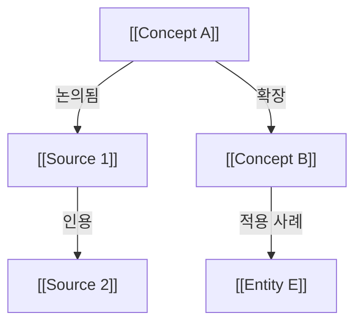
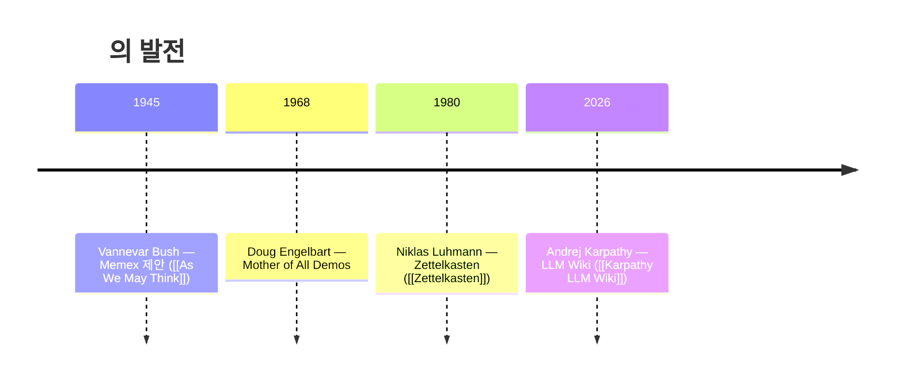
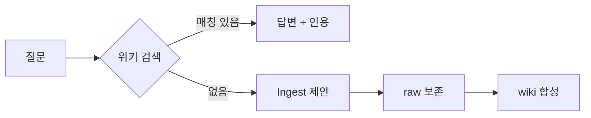

# Output Formats — Query 모드의 5가지 출력 포맷

> SKILL.md §3 (Query 모드) 의 단계 4 (출력 포맷 결정).
> 모든 포맷은 **출처 보존**: 모든 주장은 `[[Note]]` 또는 `(note.md:line)` 인용 필수.

## 0. 포맷 자동 선택

| 사용자 입력 단서 | 포맷 |
|----------------|------|
| (기본) | **§1 Markdown 답변** |
| "표 / 비교 / 정리해서 표로" | **§2 Table** |
| "슬라이드 / 발표 / 데모 / Marp" | **§3 Marp / Reveal** |
| "다이어그램 / flow / 관계도 / chart" | **§4 Mermaid** |
| "캔버스 / 시각화 / 그래프뷰" | **§5 Obsidian Canvas** (호환 모드만) |

---

## §1. Markdown 답변 (기본)

가장 흔한 케이스. 사용자 질문에 단락 + 인용으로 답함.

**템플릿**:
```markdown
**Q:** <사용자 질문>

**A:**

<핵심 답변 2~5 문단>

**근거**:
- [[Note A]] — "..." (note-a.md:14)
- [[Note B]] — "..." (note-b.md:23)

**관련 노트**:
- [[Related Synthesis]]
- [[Open Question]]

**위키에 없는 부분**:
- <발견된 gap>
- ingest 제안: <외부 소스 검색 키워드>
```

**룰**:
- 답변 본문에 wikilink 가 5개 이상이면 마지막에 **관련 노트 그래프** 1줄 요약
- 모르는 부분은 명시 — 절대 추측 채워넣지 않음
- 사용자가 "한 문장 / 짧게" 의도면 본문만, 근거는 생략 가능

---

## §2. Table

비교·정리 작업. 사용자가 "표 / 비교 / 차이 / 매트릭스" 의도.

**템플릿**:
```markdown
| 항목 | <A 노트> | <B 노트> | <C 노트> | 출처 |
|------|---------|---------|---------|------|
| <축 1> | ... | ... | ... | [[A]], [[B]], [[C]] |
| <축 2> | ... | ... | ... | [[A]], [[B]] |

**비교 축 선정 근거**: <왜 이 축들인지 1문장>

**위키 외 정보**: <표 빈칸이 있으면 명시>
```

**룰**:
- 컬럼 헤더는 노트 제목, 행은 비교 축
- 비교 축은 노트들의 frontmatter / 본문 구조에서 자동 추출 (공통 섹션)
- 빈칸은 "—" 가 아니라 "(노트 없음)" / "(위키 외)" 로 명시 — 정보 부재 가시화
- 행이 10개 넘으면 사용자에게 축약 vs 전체 확인

---

## §3. Marp / Reveal Slides

**Marp** (`marp-cli` 호환) 마크다운 슬라이드. 발표·데모용.

**템플릿**:
```markdown
---
marp: true
theme: default
paginate: true
header: '<topic>'
footer: 'LLM Wiki — generated <date>'
---

# <Topic>

> generated from wiki/<root_query>

---

## <Section 1 — overview>

- <bullet 1>
- <bullet 2>
- <bullet 3>

<!-- 출처: [[Note A]], [[Note B]] -->

---

## <Section 2 — concept X>

<!-- 핵심 인용 -->
> "<quote>" — [[Source X]]

---

## <Section 3 — synthesis>

- <synthesis bullet 1>
- <synthesis bullet 2>

---

## References

- [[Note A]] — <path>
- [[Note B]] — <path>
- [[Source X]] — <external URL>
```

**룰**:
- 슬라이드당 3~5 bullet 최대 (Marp 권장)
- 인용은 별도 슬라이드 (시각적 강조)
- 마지막에 References 슬라이드 — 모든 wikilink 평탄 나열
- 사용자가 슬라이드 수를 명시 안 했으면 5~12 적정
- 출력 파일명: `query-output/<YYYY-MM-DD>-<topic-slug>.md` (Marp 가 변환)

**렌더링 안내**:
```
파일 작성 후 사용자에게:
  marp <file>.md --html         # HTML
  marp <file>.md --pdf          # PDF
  marp <file>.md --pptx         # PPTX
```

---

## §4. Mermaid Diagram

관계도·flow·시퀀스 등. 위키 노트 간 관계 시각화.

**4-1. Concept map (그래프)**:


**4-2. Timeline (역사·sequence)**:


**4-3. Flow (의사결정)**:


**룰**:
- 노드 라벨에 `[[Note]]` 포함 (Obsidian / mermaid+markdown 환경에서 클릭 가능)
- 너무 큰 그래프 (노드 30+) — 사용자에게 subgraph 분할 제안
- 색상은 type 별 (entity=파랑, concept=초록, source=노랑, question=빨강 등)

---

## §5. Obsidian Canvas (`obsidian_compat: true` 만)

Obsidian 의 무한 캔버스 시각화. 노트들을 자유 배치 + 화살표.

**파일 포맷** (`.canvas` — JSON):
```json
{
  "nodes": [
    {
      "id": "node-1",
      "type": "file",
      "file": "wiki/concepts/llm-wiki.md",
      "x": -400, "y": -200, "width": 400, "height": 300
    },
    {
      "id": "node-2",
      "type": "file",
      "file": "wiki/sources/2026-04-30_karpathy-llm-wiki.md",
      "x": 200, "y": -200, "width": 400, "height": 300
    },
    {
      "id": "node-3",
      "type": "text",
      "text": "## 핵심 결론\n- raw + wiki + meta\n- build-time 합성",
      "x": -100, "y": 200, "width": 300, "height": 150
    }
  ],
  "edges": [
    {
      "id": "edge-1",
      "fromNode": "node-1",
      "fromSide": "right",
      "toNode": "node-2",
      "toSide": "left",
      "label": "정의됨"
    }
  ]
}
```

**룰**:
- node `type: file` 은 실제 wiki 노트 임베드 (Obsidian 가 자동 미리보기)
- node `type: text` 은 인라인 설명 카드
- 화살표 라벨로 관계 명시 (정의됨 / 인용 / 확장 / 반박)
- 출력 파일: `query-output/<topic-slug>.canvas`

**렌더링 안내**:
- Obsidian 에서 vault 안에 두면 자동 인식
- 일반 마크다운 뷰어는 미지원 — `obsidian_compat: false` 면 §4 mermaid 폴백

---

## 6. 출력 위치 규약

모든 query 결과는 휘발성. 영구 저장 의도면 사용자가 명시.

```
<WIKI_ROOT>/query-output/
  ├── <YYYY-MM-DD>-<topic-slug>.md          # markdown / table / Marp
  ├── <YYYY-MM-DD>-<topic-slug>.canvas      # Obsidian Canvas
  └── .gitignore                             # 이 디렉토리는 vc 제외 권장 (옵션)
```

**룰**:
- 사용자가 "노트로 보관" / "위키에 저장" 명시 → `wiki/syntheses/` 로 승격 (별도 ingest)
- 그렇지 않으면 `query-output/` 에만 남김 — 사용자가 정리

---

## 7. Anti-patterns (피해야 할 출력)

| 안티패턴 | 대신 |
|----------|------|
| 인용 없는 단언 | 모든 주장에 `(note.md:line)` 또는 `[[Note]]` 첨부 |
| 위키에 없는 정보를 모르게 채움 | "위키에 없음" 명시 + ingest 제안 |
| 노트 본문 통째 복사 | 핵심 발췌 + 링크 — query 답변은 합성, 복사 X |
| 너무 긴 표 (행 30+) | 축약 + 전체 따로 옵션 |
| Mermaid 노드 50+ | subgraph 분할 / synthesis 노트로 승격 제안 |
| Marp 슬라이드 1장에 bullet 10+ | 슬라이드 분할 |

---

**See also**:
- `source-types.md` — ingest 모드의 10가지 소스 타입
- `lint-rules.md` — 6가지 lint 규칙 세부
- `obsidian-compat.md` — Canvas / wikilink / Dataview
